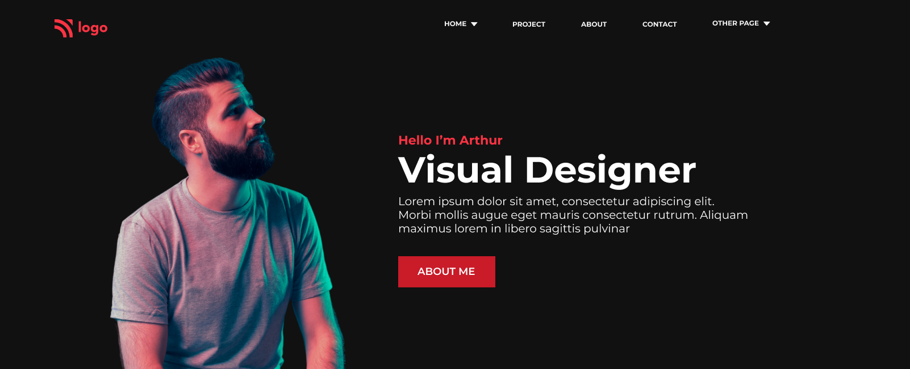

# HTML and CSS 15

Creating a page with HTML and css with bootstrap by customizing the bootstrap using scss 

### This site is built using
> - HTML
> - SCSS
> - Bootstrap
> - Fontawesome 

## What is HTML?
HTML stands for Hyper Text Markup Language It is the standard markup language for creating Web pages
and it describes the structure of a Web page.

HTML consists of a series of elements, and the elements tell the browser how to display the content.

## What is SCSS?
SCSS : Syntactically Awesome Style Sheet is the superset of CSS. SCSS is the more advanced version of CSS. Sass is a CSS pre-processor and it reduces repetition of CSS and therefore saves time

## What is Bootstrap?
Bootstrap is the most popular CSS Framework for developing responsive and mobile-first websites. It is a free, open source front-end development framework for the creation of websites and web apps.

## What is Fontawesome?
Font Awesome is the world's most popular icon set and toolkit. It is a widely-used icon set that gives you scalable vector images that can be customized with CSS

